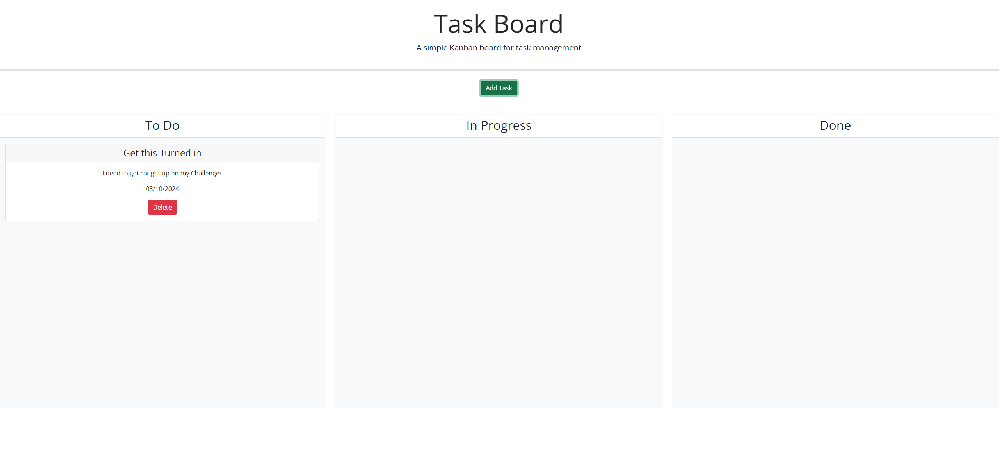

# Task Board

## Description

This page is designed for a user to be able to add, delete and adjust task as needed

## Usage

The user will click Add Task
Then they will add a title, date, and description for the task and click submit
They can then, using the pointer, adjust task progress as needed

## Links

* Github repo: https://github.com/Mtduffey36/task-board
* Github web link: https://mtduffey36.github.io/task-board/ 

## Image

